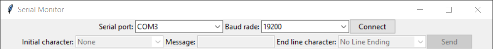
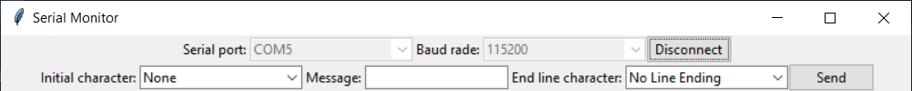

# Serial monitor

It's a little project inspired on the `Serial monitor` from `Arduino IDE`. You can connect to serial communication device and you can send and receive message from the device connected.

## Content
1. [Requirements](#requirements)
2. [Create virtual environment](#create-virtual-environment)
3. [Create executable](#create-executable)
4. [Usage](#usage)

## Requirements
- Python >= 3.6

## Create virtual environment

First you need create the virtual environment
```sh
python -v venv .venv
```
Next, you need to active the environment use:
```powershell
.\.venv\Scripts\Activate.ps1
```
if you use Windows (I recommend use powershell), or use
```sh
source ./.venv/bin/activate
```
If you would like use Linux.

```
pip install -r requirements.txt
```

## Create executable

First create a `spec` file to load the components to the executable
```sh
pyinstaller src/app.py --name SerialMonitor --onefile --noconsole
```

Edit the SerialMonitor.spec in the pathex feature
```
# SerialMonitor.spec

# (... other sections ...)
a = Analysis(
    pathex=['src']
)
# (... other sections ...)
```

Finally run the spec to build and create the output.
```sh
pyinstaller SerialMonitor.spec
```

## Usage
In the header app you can find two sections:
- Connection section
- Communication section

### Connection section
It's the first row which contains the `serial port` and `baud rate` to communicate with the device. You can choose a available `serial port` and someone `baud rate`. When you chose your features, can click on `Connect` button.

<figure class="image">
  
  <figcaption>Connection disabled</figcaption>
</figure>

### Communication section
Once connected, you can send message to the device with initial character and end line character, which are:
- Initial characters:
    - None: No initial character
    - Start of Text (STX) `\x02`
    - Start of header (SOH) `\x01`
    - Escape (ESC) `\x1B`
- End line characters:
    - No Line Ending
    - Newline `\n`
    - Carriage Return": `\r`
    - Both NL & CR": `\r\n`

<figure class="image">
  
  <figcaption>Connection enabled and ready to send message</figcaption>
</figure>